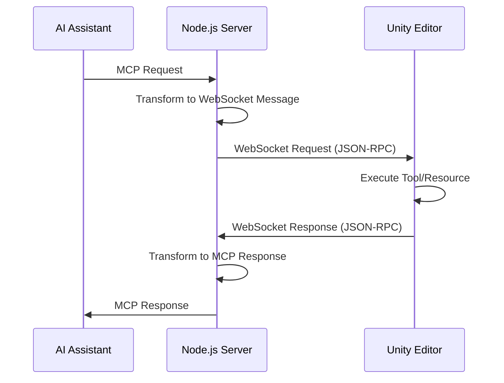

# Unity MCP Server 技術詳細ドキュメント

## 1. システムアーキテクチャ概要

Unity MCP Serverは、AI AssistantとUnity Editorを接続するブリッジシステムです。3層アーキテクチャで構成されています：

```
[AI Assistant] <--MCP Protocol--> [Node.js Server] <--WebSocket--> [Unity Editor]
```

### 各コンポーネントの役割

1. **AI Assistant（クライアント）**
   - MCPプロトコルを使用してNode.jsサーバーと通信
   - Toolの実行やResourceの取得をリクエスト

2. **Node.js MCPサーバー（ブリッジ）**
   - MCPプロトコルとWebSocketプロトコルの変換
   - リクエストのルーティングと応答の管理
   - 非同期通信の管理

3. **Unity Editor（サーバー）**
   - WebSocketサーバーとして動作
   - 実際のUnity操作を実行
   - 結果をJSON形式で返却

## 2. 通信プロトコル詳細

### 2.1 通信フロー



### 2.2 メッセージフォーマット

#### WebSocket通信（Node.js ↔ Unity）

**リクエスト形式（JSON-RPC 2.0風）:**
```json
{
  "id": "unique-request-id",
  "method": "execute_menu_item",
  "params": {
    "menuPath": "GameObject/Create Empty"
  }
}
```

**レスポンス形式:**
```json
{
  "id": "unique-request-id",
  "result": {
    "success": true,
    "type": "text",
    "message": "Successfully executed menu item: GameObject/Create Empty"
  }
}
```

**エラーレスポンス形式:**
```json
{
  "id": "unique-request-id",
  "error": {
    "type": "validation_error",
    "message": "Required parameter 'menuPath' not provided",
    "details": {}
  }
}
```

### 2.3 通信設定

**ポート設定:**
- デフォルト: 8090
- 設定ファイル: `ProjectSettings/McpUnitySettings.json`

**接続設定:**
```json
{
  "Port": 8090,
  "Host": "localhost",
  "RequestTimeoutSeconds": 10,
  "AutoStartServer": true,
  "AllowRemoteConnections": false
}
```

## 3. Unity側実装詳細

### 3.1 WebSocketサーバー構成

**主要クラス:**

1. **McpUnityServer.cs**
   - シングルトンパターンで実装
   - WebSocketサーバーの起動・停止管理
   - Tool/Resourceの登録と管理
   - Unity Editorイベントへの対応（ドメインリロード、プレイモード切替など）

2. **McpUnitySocketHandler.cs**
   - 個別のWebSocket接続を管理
   - JSON-RPCメッセージの解析と処理
   - Tool/Resourceの実行と結果返却
   - エラーハンドリング

### 3.2 Tool実装パターン

**基底クラス（McpToolBase.cs）:**
```csharp
public abstract class McpToolBase
{
    public string Name { get; protected set; }
    public string Description { get; protected set; }
    public bool IsAsync { get; protected set; } = false;
    
    // 同期実行（簡単な操作用）
    public virtual JObject Execute(JObject parameters)
    
    // 非同期実行（時間のかかる操作用）
    public virtual void ExecuteAsync(JObject parameters, TaskCompletionSource<JObject> tcs)
}
```

**実装例（MenuItemTool.cs）:**
```csharp
public class MenuItemTool : McpToolBase
{
    public MenuItemTool()
    {
        Name = "execute_menu_item";
        Description = "Executes functions tagged with the MenuItem attribute";
    }
    
    public override JObject Execute(JObject parameters)
    {
        string menuPath = parameters["menuPath"]?.ToObject<string>();
        bool success = EditorApplication.ExecuteMenuItem(menuPath);
        
        return new JObject
        {
            ["success"] = success,
            ["type"] = "text",
            ["message"] = success 
                ? $"Successfully executed menu item: {menuPath}" 
                : $"Failed to execute menu item: {menuPath}"
        };
    }
}
```

### 3.3 スレッド管理

- WebSocketメッセージはワーカースレッドで受信
- Unity APIの呼び出しはメインスレッドで実行（EditorCoroutineUtility使用）
- 非同期操作はTaskCompletionSourceで管理

## 4. Node.js側実装詳細

### 4.1 MCPサーバー構成

**主要クラス:**

1. **McpUnity.ts**
   - WebSocketクライアントとしてUnityに接続
   - リクエスト/レスポンスの管理
   - 自動再接続機能（指数バックオフ）
   - タイムアウト処理

2. **index.ts**
   - MCPサーバーのエントリーポイント
   - STDIOトランスポートの設定
   - Tool/Resourceの登録

### 4.2 WebSocket接続管理

**接続フロー:**
```typescript
class McpUnity {
    private ws: WebSocket | null = null;
    private pendingRequests: Map<string, PendingRequest> = new Map();
    
    async connect(clientName?: string): Promise<void> {
        const wsUrl = `ws://${this.host}:${this.port}/McpUnity`;
        
        // クライアント識別用ヘッダー
        const options = {
            headers: {
                'X-Client-Name': clientName || ''
            }
        };
        
        this.ws = new WebSocket(wsUrl, options);
        // WebSocketイベントハンドラー設定...
    }
    
    async sendRequest(request: UnityRequest): Promise<any> {
        const requestId = uuidv4();
        
        return new Promise((resolve, reject) => {
            // タイムアウト設定
            const timeout = setTimeout(() => {
                reject(new McpUnityError(ErrorType.TIMEOUT, 'Request timed out'));
            }, this.requestTimeout);
            
            // リクエスト保存
            this.pendingRequests.set(requestId, {
                resolve,
                reject,
                timeout
            });
            
            // メッセージ送信
            this.ws.send(JSON.stringify({
                id: requestId,
                method: request.method,
                params: request.params
            }));
        });
    }
}
```

### 4.3 Tool登録パターン

```typescript
export function registerMenuItemTool(
    server: McpServer, 
    mcpUnity: McpUnity, 
    logger: Logger
) {
    server.tool(
        'execute_menu_item',
        'Executes a Unity menu item by path',
        paramsSchema.shape,
        async (params: any) => {
            const response = await mcpUnity.sendRequest({
                method: 'execute_menu_item',
                params: { menuPath: params.menuPath }
            });
            
            return {
                content: [{
                    type: response.type,
                    text: response.message
                }]
            };
        }
    );
}
```

## 5. 自動再接続メカニズム

### Unity側（ドメインリロード対応）

```csharp
// アセンブリリロード前にサーバー停止
AssemblyReloadEvents.beforeAssemblyReload += OnBeforeAssemblyReload;

// アセンブリリロード後に自動再起動
AssemblyReloadEvents.afterAssemblyReload += OnAfterAssemblyReload;

// プレイモード切替時の対応
EditorApplication.playModeStateChanged += OnPlayModeStateChanged;
```

### Node.js側（再接続ロジック）

```typescript
// 指数バックオフによる再接続
private calculateBackoff(): number {
    // 1s, 2s, 4s, 8s, ..., max 30s
    return Math.min(this.retryDelay * Math.pow(2, this.reconnectAttempts), 30000);
}
```

## 6. エラーハンドリング

### エラータイプ

1. **CONNECTION** - 接続エラー
2. **TIMEOUT** - タイムアウトエラー
3. **TOOL_EXECUTION** - Tool実行エラー
4. **VALIDATION** - パラメータ検証エラー
5. **UNKNOWN** - 不明なエラー

### エラー伝播

```
Unity Exception → WebSocket Error Response → Node.js McpUnityError → MCP Error Response
```

## 7. セキュリティと制限

### アクセス制御
- デフォルトはlocalhostのみ接続可能
- `AllowRemoteConnections`設定でリモート接続を許可可能

### タイムアウト設定
- デフォルト: 10秒
- 環境変数または設定ファイルで変更可能

### スレッドセーフティ
- Unity APIへのアクセスはメインスレッドで実行
- 非同期操作は適切に同期化

## 8. デバッグとトラブルシューティング

### ログレベル
- Unity側: McpLogger（Unity Console出力）
- Node.js側: Logger（stdout出力）

### 一般的な問題と解決策

1. **ポート競合**
   - 症状: "Port already in use"エラー
   - 解決: ポート番号を変更またはプロセスを終了

2. **ドメインリロード後の接続失敗**
   - 症状: Unity再コンパイル後に接続できない
   - 解決: 自動再接続を待つ（最大30秒）

3. **タイムアウトエラー**
   - 症状: 10秒後にタイムアウト
   - 解決: RequestTimeoutSecondsを増やす

## 9. パフォーマンス考慮事項

### メッセージサイズ
- 大きなデータはチャンク化を検討
- JSON シリアライゼーションのオーバーヘッドに注意

### 並行処理
- 複数のリクエストは並行処理可能
- Unity側はメインスレッドでシーケンシャル実行

### メモリ管理
- 長時間実行時のメモリリークに注意
- pendingRequestsの適切なクリーンアップ